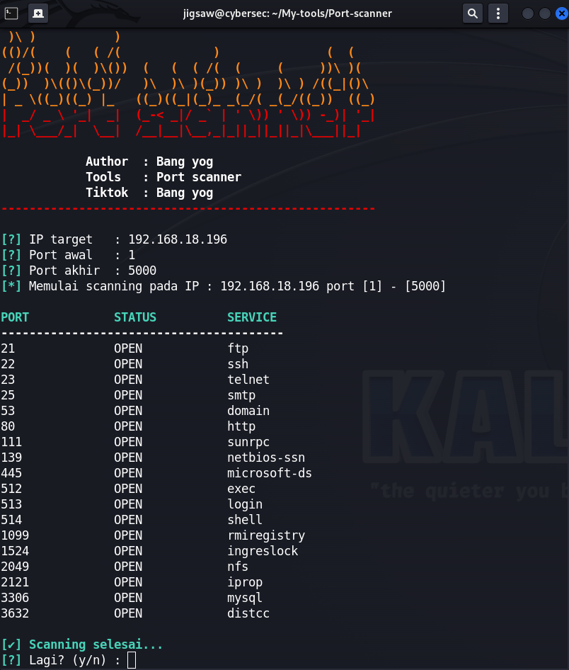

# 🔍 Port Scanner
[](LICENSE) 
[]

Tools sederhana berbasis **Python** untuk melakukan scanning port pada sebuah host atau domain.  
Dibuat untuk tujuan **edukasi dan penetration testing legal**, bukan untuk aktivitas ilegal.

---

## ✨ Fitur
- 🔎 Scan port tertentu atau range port
- ⚡ Menampilkan status **Open / Closed** dari setiap port
- 💻 Ringan, simple, bisa dijalankan di semua OS (Linux/Windows)
- 📜 Output hasil scan yang mudah dibaca

---

## 📦 Instalasi
Clone repository ini ke device kamu:

```bash
git clone https://github.com/YogaRmdn/Port-scanner.git
cd Port-scanner
python scan.py
```


